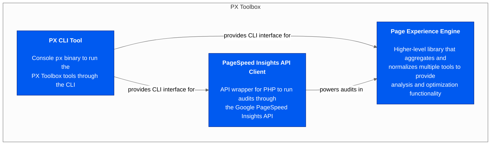
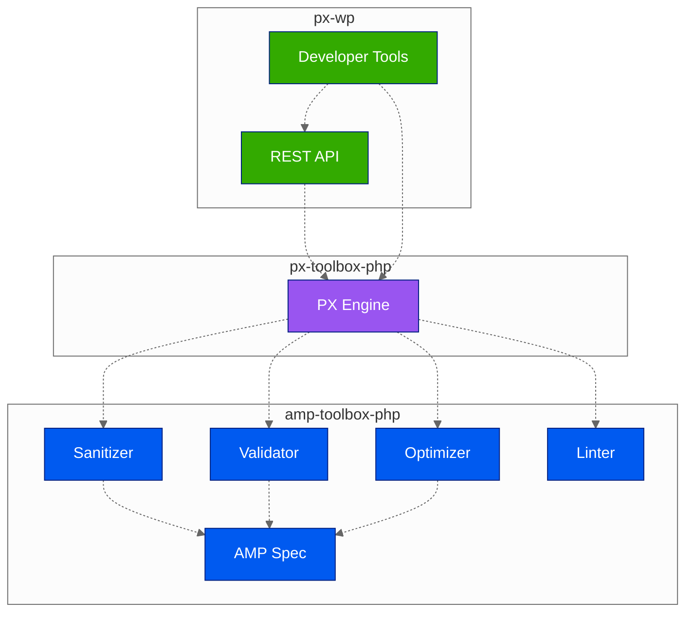

<div id="top"></div>

<div align="center">
<h3 align="center">Page Experience Toolbox for PHP</h3>
  <p align="center">
    Tooling to get the best possible page experience results out of your PHP-powered web properties.
    <br />
    <a href="https://github.com/ampproject/px-toolbox-php/tree/main/docs/README.md#readme"><strong>Explore the docs »</strong></a>
    <br />
    <br />
    <a href="https://github.com/ampproject/px-toolbox-php/issues">Report Bug</a>
    ·
    <a href="https://github.com/ampproject/px-toolbox-php/issues">Request Feature</a>
  </p>
</div>

<details>
  <summary>Table of Contents</summary>
  <ol>
    <li>
      <a href="#about-the-project">About The Project</a>
    </li>
    <li>
      <a href="#getting-started">Getting Started</a>
      <ul>
        <li><a href="#prerequisites">Prerequisites</a></li>
        <li><a href="#installation">Installation</a></li>
      </ul>
    </li>
    <li><a href="#usage">Usage</a></li>
    <li><a href="#roadmap">Roadmap</a></li>
    <li><a href="#contributing">Contributing</a></li>
    <li><a href="#license">License</a></li>
  </ol>
</details>

## About The Project

The Page Experience Toolbox for PHP regroups tooling and library code that enables you to maximize your page experience results for any PHP-powered web properties.

Currently included in the toolbox:

* [**Page Experience Engine** - Higher-level library that aggregates and normalizes multiple tools to provide analysis and optimization functionality.](/docs/pxe/README.md#readme)
* [**PageSpeed Insights API** - API wrapper for PHP to run audits through the Google PageSpeed Insights API.](/docs/psi/README.md#readme)
* [**PX CLI tool** - `px` binary to run the above tooling through the console.](/docs/px/README.md#readme)



<p align="right">(<a href="#top">back to top</a>)</p>

## Getting Started

This is an example of how you may give instructions on setting up your project locally.
To get a local copy up and running follow these simple example steps.

### Prerequisites

The following requirements need to be fulfilled by your PHP installation to make use of the toolbox:

* PHP 5.6+
* Active PHP extensions:
   * `curl`
   * `json`
   * `zip`
* Remote connectivity for API requests against the Google PageSpeed Insights API

### Installation

The toolbox can be pulled into your project via Composer:

```sh
composer require ampproject/px-toolbox
```

In case you're only interested in making use of the `px` binary without integrating the library code into an existing project, you can also install the toolbox as a global Composer package:

```sh
composer global require ampproject/px-toolbox
```

<p align="right">(<a href="#top">back to top</a>)</p>

## Usage

Use this space to show useful examples of how a project can be used. Additional screenshots, code examples and demos work well in this space. You may also link to more resources.

_For more examples, please refer to the [Documentation](https://example.com)_

<p align="right">(<a href="#top">back to top</a>)</p>

## Roadmap

The project is currently in its very early stages, with the main focus lying on making the main functionality work as expected.

The initial end-user integration this library is being coded against is the [PX Plugin for WordPress](https://github.com/ampproject/amp-wp).



The roadmap will be further fleshed out as we approach the first feature-complete release. 

<p align="right">(<a href="#top">back to top</a>)</p>

## Contributing

Please see [the CONTRIBUTING file](/CONTRIBUTING.md) for information on contributing to the Page Experience Toolbox for PHP.

<p align="right">(<a href="#top">back to top</a>)</p>

## License

The PHP Page Experience Toolbox is licensed under the [Apache License, Version 2.0](/LICENSE).

<p align="right">(<a href="#top">back to top</a>)</p>
