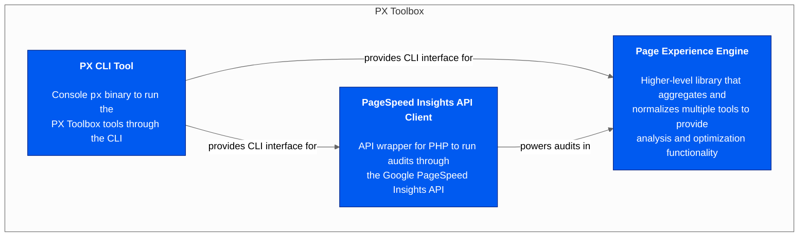

# Documentation Index

The Page Experience Toolbox for PHP contains multiple different tools and libraries.

Click on one of the entries below to learn more about that sub-project:

* [**Page Experience Engine** - Higher-level library that aggregates and normalizes multiple tools to provide analysis and optimization functionality.](/docs/pxe/README.md#readme)
* [**PageSpeed Insights API** - API wrapper for PHP to run audits through the Google PageSpeed Insights API.](/docs/psi/README.md#readme)
* [**PX CLI tool** - `px` binary to run the above tooling through the console.](/docs/px/README.md#readme)

