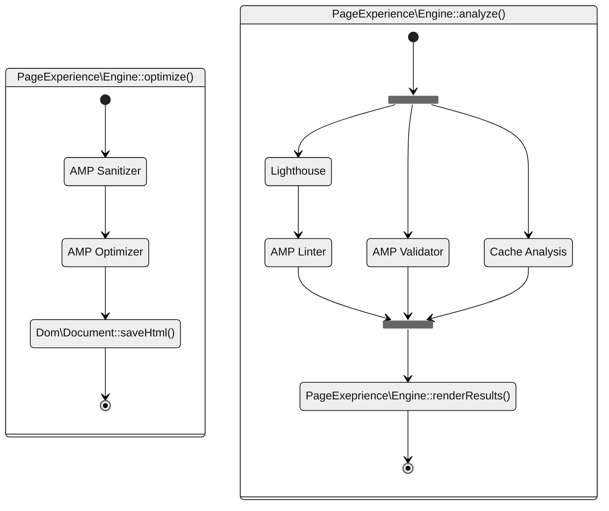
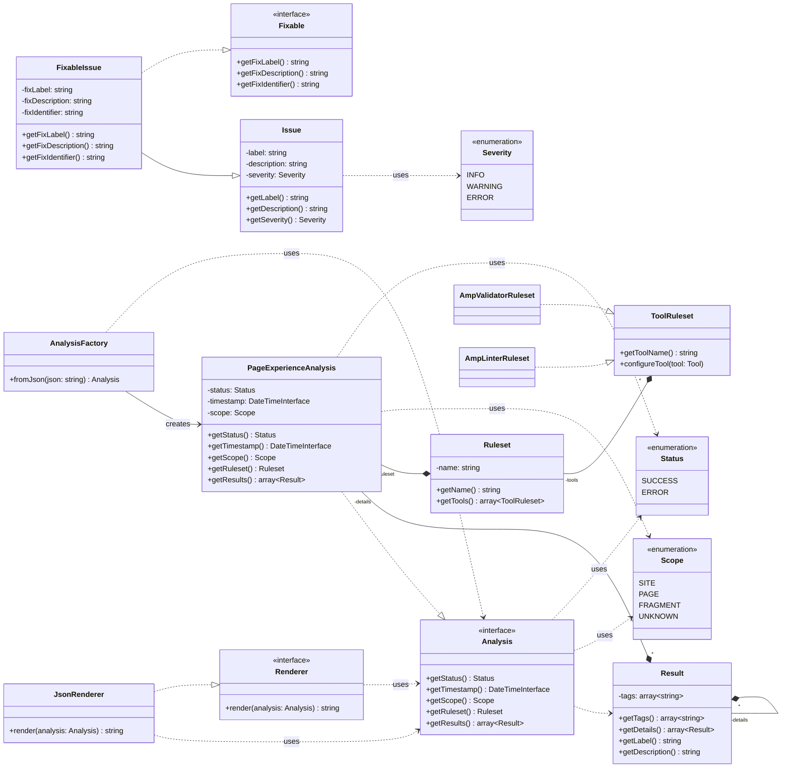

# Page Experience Engine

Higher-level library that aggregates and normalizes multiple tools to provide analysis and optimization functionality.

## Overview

At its most basic, the Page Experience Engine (PXE) is a higher-level tool to configure and execute a pipeline of
lower-level tools and collect their output in a normalized way.

It provides multiple profiles that it can run, with each profile being a set of configuration options for each of the
included tools.

The output is shaped in such a way that it becomes digestible as guidelines/AIs for a site owner who wants to take
progressive steps to improve their site’s Page Experience rating.

Multiple cumulative profiles allow the site owner to start with the low-hanging fruit and work through guidelines to
meet more and more ambitious milestones.

### Primary Goal

The PXE is an abstraction layer built on top of the existing and future tooling that decouples changes in the tooling
from the UI/UX requirements of a framework or CMS integration.

Using this approach, the user interface within the integration needs to be designed and implemented only once, against
the normalized data model that PXE returns. Any future changes to the tooling, like adapting validation rules and specs
or adding a completely new CLI tool, will only need normalization logic within the PXE. The user interface of the
integration will remain mostly unaffected by these changes.

This in turn means we can transparently move the underlying technology out of focus and rather concentrate on the actual
outcome. For a non-technical end user, does it really matter what exact HTML framework was in use when the page is
demonstrably at its fastest and meets all required thresholds?

## The Toolbelt

The PXE is an abstraction using a pipeline for running multiple tools and aggregating their results.

Configuring a tool to be included will happen by implementing interfaces that PXE provides. Once an implementation
exists for the interfaces that PXE needs for a given tool, that tool can be included in any PXE configuration file and
configured via that configuration file’s rules.

PXE also manages dependencies amongst tools, so that a given tool can depend on and make use of results that were
gathered from a different tool. This can for example be used to make the Lighthouse audit results (which include the
CWV) available to the AMP Linter tool. This is also a requirement for something like the Sanitizer, where it does not
make sense to run other diagnostics on the unsanitized content.

For the best runtime behavior, PXE can run multiple tools in parallel (optionally), while ensuring that inter-dependent
tools still run sequentially.

This combination of parallel runs and sequential dependencies that build on top of each other will result in a branching
execution flow that optimizes itself based on system resources.



### Analysis Results Object Model

The following diagram provides a simplified (work-in-progress) of the object model that is produced by the PXE.

_Note: Classes are clickable and will bring you to the latest version of the corresponding code._



## Instantiation

The [`PageExperience\Engine`](/src/Engine.php) can be directly instantiated by invoking its constructor.

It supports two arguments:

| name | description |
| ---- | ----------- |
| **`$remoteGetRequest`** | Optional. The [`AmpProject\RemoteGetRequest`](https://github.com/ampproject/amp-toolbox-php/blob/main/src/RemoteGetRequest.php) instance to use for managing remote requests that some of the internal tools need to make. |
| **`$toolStackFactory`** | Optional. The [`PageExperience\Engine\ToolStack\ToolStackFactory`](/src/Engine/ToolStack/ToolStackFactory.php) instance to use for assembling the toolstack that is internally used by the engine. |

If no `$remoteGetRequest` instance is provided, the library will instantiate an instance of type [`AmpProject\RemoteRequest\CurlRemoteGetRequest`](https://github.com/ampproject/amp-toolbox-php/blob/main/src/RemoteGetRequest/CurlRemoteGetRequest.php) to do regular, uncached requests through the PHP `curl` extension.

If no `$toolStackFactory` instance is provided, the library will instantiate an instance of type [`PageExperience\Engine\ToolStack\DefaultToolStackFactory`](/src/Engine/ToolStack/ToolStackFactory.php). This includes support for all the tools that are shipped by default with the PX Toolbox.

```php
$pxEngine = new \PageExperience\Engine();
```

## Usage

### Analyze a URL

To run an analysis with the page experience engine, you can use its `analyze()` method:

```php
// TODO: Instantiation mechanism for configuration profile is missing.
$profile = new ConfigurationProfile();

$analysis = $pxEngine->analyze($url, $profile);
```

The returned `$analysis` will be of type [`PageExperience\Engine\Analysis`](/src/Engine/Analysis.php).

### Optimize a string of HTML

To run an optimization with the page experience engine on a string of HTML, you can use its `optimizeHtml()` method:

```php
// TODO: Instantiation mechanism for configuration profile is missing.
$profile = new ConfigurationProfile();

$optimizedHtml = $pxEngine->optimizeHtml($html, $profile);
```

The returned `$optimizedHtml` will be a string of highly optimized HTML that should still return the same look-and-feel than the original HTML, but with a higher page experience score and improved core web vitals.

### Optimize a PSR-7 response

To run an optimization with the page experience engine on a [PSR-7](http://www.php-fig.org/psr/psr-7/) response, you can use its `optimizeResponse()` method:

```php
// TODO: Instantiation mechanism for configuration profile is missing.
$profile = new ConfigurationProfile();

$optimizedResponse = $pxEngine->optimizeResponse($response, $profile);
```

The returned `$optimizedResponse` will be a PSR-7 response object for which both the headers and the body were optimized. The response should still return the same look-and-feel than the original response, but with a higher page experience score and improved core web vitals.

## Adapting the Handling of Remote Requests

The implementation to use for fulfilling requests made via the [`AmpProject\RemoteGetRequest`](https://github.com/ampproject/amp-toolbox-php/blob/main/src/RemoteGetRequest.php) interface can be injected into the [`PageExperience\Engine`](/src/Engine.php) via its first, optional argument:

```php
$pxEngine = new \PageExperience\Engine(
	// A custom implementation that lets you control how remote requests are handled.
	new MyCustomRemoteGetRequestImplementation()
);
```

If this optional argument is not provided when instancing the PX engine, the default [`AmpProject\RemoteRequest\CurlRemoteGetRequest`](https://github.com/ampproject/amp-toolbox-php/blob/main/src/RemoteRequest/CurlRemoteGetRequest.php) implementation is used.

There are other implementations already provided that can be useful:

| Class (short name) | Description |
|-------|-------------|
| [`CurlRemoteGetRequest`](https://github.com/ampproject/amp-toolbox-php/blob/main/src/RemoteRequest/CurlRemoteGetRequest.php) | Remote request transport using cURL. This is the default implementation that will be used if you don't provide one explicitly.<br><br>It has the following configuration settings as constructor arguments:<br>**$sslVerify** - Whether to verify SSL certificates. Defaults to true.<br>**$timeout** - Timeout value to use in seconds. Defaults to 10.<br>**$retries** - Number of retry attempts to do if an error code was thrown that is worth retrying. Defaults to 2. |
| [`FallbackRemoteGetRequest`](https://github.com/ampproject/amp-toolbox-php/blob/main/src/RemoteRequest/FallbackRemoteGetRequest.php) | Fallback pipeline implementation to go through a series of fallback requests until a request succeeds. The request will be tried with the first instance provided, and follow the instance series from one to the next until a successful response was returned.<br><br>It has the following configuration settings as constructor arguments:<br>**...$pipeline** - Variadic array of RemoteGetRequest instances to use as consecutive fallbacks. |
| [`FilesystemRemoteGetRequest`](https://github.com/ampproject/amp-toolbox-php/blob/main/src/RemoteRequest/FilesystemRemoteGetRequest.php) | Fetch the response for a remote request from the local filesystem instead. This can be used to provide offline fallbacks.<br><br>It has the following configuration settings as constructor arguments:<br>**$argumentMap** - Associative array of data for mapping between provided URLs and the filepaths they should map to. |
| [`StubbedRemoteGetRequest`](https://github.com/ampproject/amp-toolbox-php/blob/main/src/RemoteRequest/StubbedRemoteGetRequest.php) | Stub for simulating remote requests. This is mainly used for writing tests.<br><br>It has the following configuration settings as constructor arguments:<br>**$argumentMap** - Associative array of data for mapping between provided URLs and the body content they should return. |

To build your own transport, you'll need to implement the [`AmpProject\RemoteGetRequest`](https://github.com/ampproject/amp-toolbox-php/blob/main/src/RemoteGetRequest.php) interface. For a more involved example of a custom transport or for integrating with your stack of choice, see the two implementations provided by the `Page Experience for WordPress` WordPress plugin:

- [`AmpProject\AmpWP\RemoteRequest\CachedRemoteGetRequest`](https://github.com/ampproject/amp-wp/blob/develop/src/RemoteRequest/CachedRemoteGetRequest.php)
- [`AmpProject\AmpWP\RemoteRequest\WpHttpRemoteGetRequest`](https://github.com/ampproject/amp-wp/blob/develop/src/RemoteRequest/WpHttpRemoteGetRequest.php)
